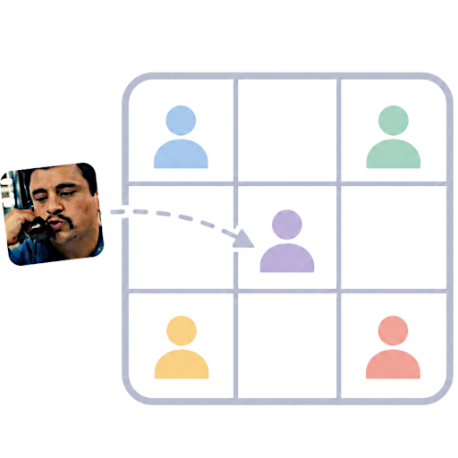

<h1 align="center" style="margin:0;">

</h1>
<h3 align="center" style="margin: 0; margin-top: 0;">
Team Builder — bringing people together against their will.
</h3>

<p align="center">
  <a href="#features">Features</a> •
  <a href="#limitations">Limitations</a>
</p>

## Overview

A single-file, web app for splitting a class roster into teams.

Everything runs in the browser. There's no server and no data ever leaves your
machine.

**[Launch Team Builder](https://gip-triad.github.io/teambuilder/)**

## Features

- **Upload a CSV** of students (`name, university, gender`).
- **Configure teams**: choose the number of teams and set each team's size
  individually.
- **Toggle constraints**: ensure university coverage and gender balance.
- **Pairing rules**: optionally require two specific students to be on the same
  team, or keep them apart.
- **Click-to-lock board**: click a student's name to lock them into a team. The app
  will:
  - grey out any choice that would make the board unsolvable,
  - automatically lock in a student's team the moment it becomes the *only*
    remaining valid option,
  - star its top 1–2 recommended arrangements for whichever students aren't locked
    yet.
- **Undo / Reset**: step back or start over.
- **Export**: download the current team composition as a CSV.
- **Next round, different groups**: once a set of teams is locked in, click **Start
  next round** to save it as a reference and build a fresh set of teams
biased toward
  putting students with *different* teammates than last time.
- **Autosaves locally** as you go, so refreshing the page won't lose your progress.

## CSV format

```csv
name,university,gender
Chen,Singapore,M
Lulu,Singapore,F
Marcel,Marseille,M
Dominique,Marseille,F
```

- `gender` accepts `M`/`F` or `Male`/`Female`.
- Basic quoted fields are supported (e.g. `"Doe, Jane"`)

### Exported CSV

`Export CSV` produces one row per student:

```csv
team,name,university,gender
Team Alpha,Chen,Singapore,M
Team Alpha,Marcel,Marseille,M
Team Beta,Dominique,Marseille,F
(unplaced),Cristina,Naples,F
```

Only students you've actually locked into a team are listed under that team.

## Limitations

- CSV parsing supports basic quoted fields but isn't a full RFC4180 implementation.
- Not tested for rosters larger than ~15 students.
